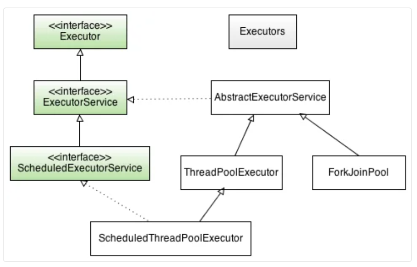

## ThreadPools In Java

**A Thread pool in Java is a collection of pre-initialized worker threads that are available to perform tasks. 
Instead of creating a new thread for each task, tasks are submitted to the thread pool, which manages the execution of the tasks using the available threads.**

**Here are the key reasons why thread pools are useful:** 

**Reduced Overhead:** 
Creating a new thread for each task is expensive due to the resources and time involved. Thread pools reuse existing threads, reducing the overhead of thread creation and destruction.  
**Resource Management:** 
Thread pools limit the number of active threads, preventing the application from consuming excessive system resources such as memory and CPU. This helps avoid resource exhaustion and improves overall system stability.  
**Improved Performance:** 
By reusing threads, thread pools reduce the latency associated with thread creation. This leads to faster task execution and improved overall application responsiveness.  
**Concurrency Control:** 
Thread pools allow for concurrent execution of multiple tasks, which can significantly improve the performance of applications that perform many operations in parallel.  
**Task Management:** 
Thread pools provide a mechanism for managing the execution of tasks, including queuing, scheduling, and handling task rejection when the pool is full.  

In summary, thread pools are useful for managing concurrent tasks efficiently, reducing overhead, and improving the performance and stability of multithreaded applications.

